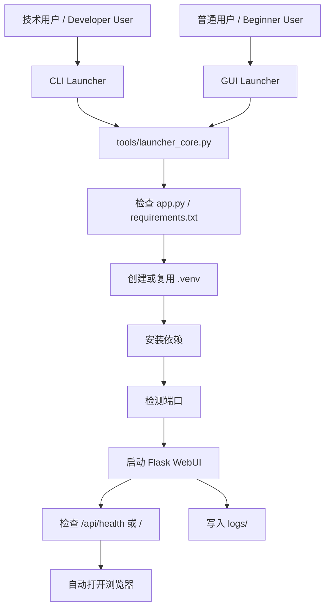

# Launcher Design / 启动器设计说明

## 目标

为本地 Flask WebUI 增加一层启动器外壳，让普通用户无需理解 Flask、venv、pip 或命令行参数，也可以完成启动。

启动器不替代业务逻辑，不修改测算规则，只负责本地运行体验。

## 架构



## 文件说明

```text
tools/
├── launcher_core.py    # 共享启动逻辑
├── cli_launcher.py     # 命令行启动器
└── gui_launcher.py     # 图形化启动器

start.bat              # Windows GUI 双击入口
start_cli.bat          # Windows CLI 入口
start.command          # macOS GUI 双击入口
start.sh               # Linux/macOS CLI 入口
start_gui.sh           # Linux/macOS GUI 入口
requirements-gui.txt   # GUI 可选依赖
```

## 启动流程

1. 查找项目根目录。
2. 检查 `app.py` 与 `requirements.txt`。
3. 创建或复用 `.venv`。
4. 升级虚拟环境中的 pip。
5. 安装 `requirements.txt`。
6. 检测端口是否可用。
7. 通过环境变量 `CZ_APP_PORT` 启动 Flask。
8. 访问 `/api/health`，失败时回退检查 `/`。
9. 启动成功后自动打开浏览器。
10. 退出时终止 Flask 子进程。

## 端口策略

默认端口为 `5055`。如果端口被占用，启动器默认自动尝试 `5056`、`5057` 等后续端口。

命令行模式可通过以下参数关闭自动换端口：

```bash
python tools/cli_launcher.py --no-port-fallback
```

## GUI 设计原则

GUI 启动器定位为“本地 WebUI 管理器”，而不是完整桌面应用。

基础功能：

- 启动 WebUI
- 停止 WebUI
- 打开浏览器
- 重新安装依赖
- 打开日志文件夹
- 打开项目文件夹
- 显示运行日志

视觉风格：

- 现代、简洁、轻量
- 默认跟随系统明暗模式
- 保留非官方工具提示
- 不使用南航官方 Logo 或官方视觉素材

## 后续可扩展方向

- 选择端口
- 清空/重建虚拟环境
- 打开导出文件夹
- 检查项目版本
- 导出错误日志
- PyInstaller 打包为 Windows/macOS 小白包
